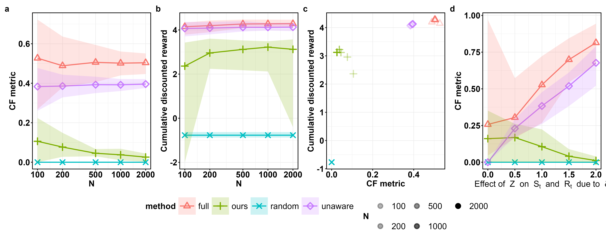

Empirical Results (Synthetic Data)
========================

This section presents an empirical illustration of unfairness reduction resulting 
from using :code:`SequentialPreprocessor` provided in :code:`PyCFRL`. In particular, 
we run experiments using synthetic trajectory data based on the design of synthetic 
data experiments in `Wang et al. (2025) <https://arxiv.org/abs/2501.06366>`_ with 
some minor adjustments. 

These illustrations are produced using version 0.3.0 of :code:`PyCFRL`.

Methods Being Compared
-------------------------

We compare the performance of the following methods:

- **Random:** Policy that selects each action randomly with equal probability.
- **Full:** Method that uses all variables, including the sensitive attribute, for policy learning.
- **Unaware:** Method that uses all variables except the sensitive attribute for policy learning.
- **Ours:** Method that uses :code:`SequentialPreprocessor` to preprocess training trajectories before policy learning.

Data-generating Environment
--------------------------

Let :math:`S_t`, :math:`A_t`, :math:`R_t` refer to the state, action, and reward, respectively, at time step :math:`t`.
Let :math:`Z` refer to the observed sensitive attribute, such as gender or race.
The data-generating environment used is:

.. math::

    S_0 =& -0.3 + 1.0 \delta Z + U_0^S, \\
    S_t =& -0.3 + 1.0 \delta (Z - 0.5) + 0.5S_{t-1} + 0.4(A_{t-1} - 0.5) + 0.3 S_{t-1}(A_{t-1} - 0.5) \\
    &+ 0.3 \delta S_{t-1} (Z - 0.5) + 0.4 \delta (Z - 0.5)(A_{t-1} - 0.5) + U_t^S \text{ (for $t \geq 1$)}, \\
    R_t =& -0.3 + 0.3S_t + 0.5 \delta Z + 0.5A_t + 0.2 \delta S_tZ + 0.7S_tA_t - 1.0 \delta ZA_t + U_t^R,

where :math:`U_t^S, U_t^R \overset{\text{i.i.d.}}{\sim} N(0,1)` for :math:`t \geq 0`. 
:math:`\delta` is a constant that controls the strength of impact of the sensitive attribute on the state and reward variables; there will be no fairness issues if :math:`\delta=0`.

Evaluation Metrics
--------------------------

We evaluate the performance of the methods using policy value and level of counterfactual unfairness. 
Policy value refers to the discounted cumulative rewards obtained by the policy. 
In our experiments, we run the policy in the above data-generating environment with 10000 individuals and 10 transitions using the :code:`evaluate_reward_through_simulation()` function. 
The policy value is estimated by the discounted cumulative rewards collected by the policy during the run.

The level of counterfactual fairness is assessed using the following CF metric proposed by `Wang et al. (2025) <https://arxiv.org/abs/2501.06366>`_:

.. math:: 

    \max_{z', z \in eval(Z)} \frac{1}{NT} \sum_{i=1}^{N} \sum_{t=1}^{T} 
    \mathbb{I} \left( A_t^{Z \leftarrow z'}\left(\bar{U}_t(h_{it})\right) 
    \neq A_t^{Z \leftarrow z}\left(\bar{U}_t(h_{it})\right) \right).
    
where :math:`eval(Z)` is the set of valid sensitive attributes, 
:math:`A_t^{Z \leftarrow z'}\left(\bar{U}_t(h_{it})\right)` is the action taken in the 
counterfactual trajectory under :math:`Z=z'`, and 
:math:`A_t^{Z \leftarrow z}\left(\bar{U}_t(h_{it})\right)` is the action taken in the 
counterfactual trajectory under :math:`Z=z`. This metric is bounded between 0 and 1, with 0 
representing perfect fairness and 1 indicating complete unfairness.

In our experiments, we run the policy in the above data-generating environment with 10000 individuals and 10 transitions using the :code:`evaluate_fairness_through_simulation()` function. 
The CF metric is calculated using the actions taken by the policy during the run.

Experiment Design
--------------------------
We run two sub-experiments the evaluate different aspects of the methods' performance:

- **Experiment 1:** We fix :math:`\delta=1`, the number of transitions in the training trajectory :math:`T=10`, and vary the number of individuals in the training trajectory :math:`N \in \{100, 200, 500, 1000, 2000\}`. This aims to evaluate how the performance changes with the training sample size.
- **Experiment 2:** We fix the number of transitions in the training trajectory :math:`T=10` and the number of individuals in the training trajectory :math:`N=100`, and vary :math:`\delta \in \{0.0, 0.5, 1.0, 1.5, 2.0\}`. This aims to evaluate how the performance changes with the amount of inherent bias present in the training trajectory.

Results
--------------------------

The plots above summarize the empirical results. The results are aggregated across 50 replications, with the dots representing the mean and the bands representing the range between the 0.025 and 0.975 empirical quantiles. Some takeaways include:

- In terms of the CF metric, "Ours" consistently outperforms "Full" and "Unaware" across all the levels of :math:`N` and :math:`\delta` tested. This demonstrates that using :code:`SequentialPreprocessor` reduces the level of counterfactual unfairness in our experiment.
- The CF metric resulting from "Ours" decreases as :math:`N` increases, which supports the consistency of :code:`SequentialPreprocessor`.
- The policy value of "Ours" is lower than those of "Full" and "Unaware", which suggests a trade-off between policy value and counterfactual fairness. 

Experiment Code
--------------------------

The code used to run Experiment 1 can be found `here <https://github.com/JianhanZhang/PyCFRL/blob/main/experiments/synthetic_data_exp_N.py>`_.
The code used to run Experiment 2 can be found `here <https://github.com/JianhanZhang/PyCFRL/blob/main/experiments/synthetic_data_exp_Z.py>`_.